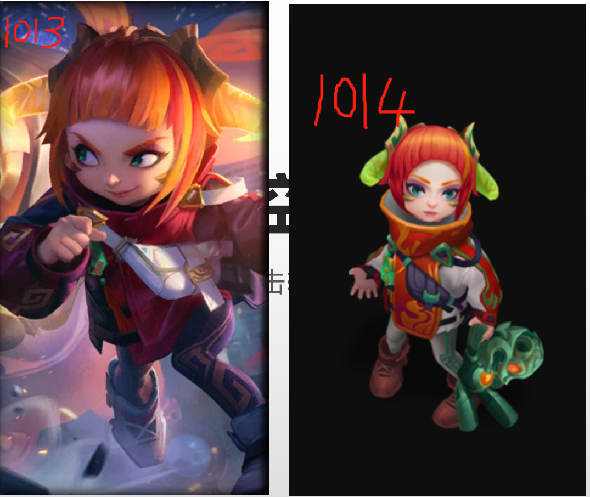
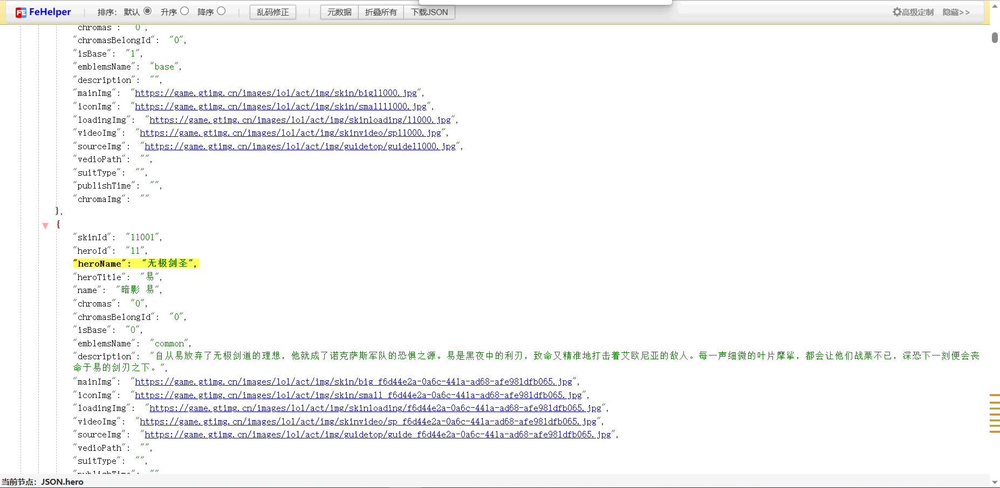

# Hero-Skin

Java爬取王者荣耀和英雄联盟的英雄皮肤。

注意该项目仅仅是为了爬取，不进行存储，存储放到另外的项目：

王者荣耀：

- <https://gitee.com/yansheng0083/hero-skin-image>
- <https://github.com/yansheng836/hero-skin-image>

英雄联盟：

- <https://gitee.com/yansheng0083/hero-skin-lol>
- <https://github.com/yansheng836/hero-skin-lol>

## 王者荣耀

爬取方式：

1. 先将英雄介绍主页下载到本地（项目跟目录）；
2. 爬取该网页，获取英雄列表数据（包含单个英雄主页URL）；
3. 遍历爬取每一个英雄主页，获得英雄皮肤ID，拼接URL；
4. 下载图片。

### 相关信息

官网英雄介绍主页：<https://pvp.qq.com/web201605/herolist.shtml>，如果出英雄需要先下载该页面（放到脚本目录），然后执行脚本才有效。

爬取王者荣耀的英雄皮肤图片，详情请看对应python仓库：<https://github.com/yansheng836/hero-skin-images>。

游戏壁纸：<https://pvp.qq.com/web201605/wallpaper.shtml>

### 统计

到目前为止，王者荣耀一共有96个英雄，366个皮肤（含伴生皮肤）。

|         时间          | 英雄数量 | 皮肤数量 |
| :-------------------: | :------: | :------: |
|      2019-11-14       |    96    |   366    |
| 2021年1月30日23:41:04 |    96    |   422    |
| 2021年1月30日23:51:42 |   104    |   439    |
| 2021年5月12日18:26:00 |   104    |   463    |
| 2021年6月12日22:25:16 |   105    |   465    |
| 2023年4月30日01:09:57 |   114    |   617    |

### 存在问题

爬取的网页数据不是最新的，如直接爬取最新的英雄为93，506，云中君；但是将该网页下载后再爬取，最新,96，523，西施。

处理方法：可以将网页先下载下来，爬取本地文件。

### bug

小图有一张有问题：

```
图片链接(https://game.gtimg.cn/images/yxzj/img201606/heroimg/142/142-bigskin-5.jpg)无效！响应状态码为：404
```

直接访问也是404。

### 辅助功能

统计英雄皮肤图片数量，拼接成json数据，为hexo博客提供每日切换背景图片的效果（现在有367张图片）。

主要程序：

- `DownloadBigskinWallpaper.java`：电脑壁纸，对应json：`wzry_mobile_367.json`
- `DownloadMobileskinWallpaper.java`：手机壁纸，对应json：`wzry_wallpaper367.json`

## 英雄联盟(LOL)

爬取方式：

1. 先将英雄介绍主页下载到本地（项目跟目录）；
2. 爬取该网页，获取英雄列表数据（包含单个英雄主页URL）；
3. 遍历爬取每一个英雄资料JSON数据，获得英雄皮肤ID，拼接URL；（因为单个英雄主页皮肤信息使用了js动态加载不能直接爬取，只能换个方式）
4. 下载图片。

### 相关信息

官网英雄介绍主页：<http://lol.qq.com/data/info-heros.shtml>

全部数据：<https://game.gtimg.cn/images/lol/act/img/js/heroList/hero_list.js>

单个英雄数据：`'//game.gtimg.cn/images/lol/act/img/js/hero/' + heroid + '.js'`

如：<http://game.gtimg.cn/images/lol/act/img/js/hero/1.js>

### 存在问题

#### 问题1：透明图片问题

单个英雄json后面皮肤几个皮肤好像只是简单的透明的模型，并没有完整的皮肤信息。

例如：<http://game.gtimg.cn/images/lol/act/img/js/hero/1.js>，完整的皮肤json应该是这样的

```json
{
    "skinId": "1013",
    "heroId": "1",
    "heroName": "黑暗之女",
    "heroTitle": "安妮",
    "name": "福牛守护者 安妮",
    "chromas": "0",
    "chromasBelongId": "0",
    "isBase": "0",
    "emblemsName": "Year of Ox",
    "description": "当安妮被选为福牛守护者的技术特工时，所有人都震惊了。安妮是一个早熟的神童，职责是团队的侦查战略家，确保巡游路线上没有平民。",
    "mainImg": "https://game.gtimg.cn/images/lol/act/img/skin/big1013.jpg",
    "iconImg": "https://game.gtimg.cn/images/lol/act/img/skin/small1013.jpg",
    "loadingImg": "https://game.gtimg.cn/images/lol/act/img/skinloading/1013.jpg",
    "videoImg": "https://game.gtimg.cn/images/lol/act/img/skinvideo/sp1013.jpg",
    "sourceImg": "https://game.gtimg.cn/images/lol/act/img/guidetop/guide1013.jpg",
    "vedioPath": "",
    "suitType": "",
    "publishTime": "",
    "chromaImg": ""
}
```

但是后面有这样的：不完整的

```json
{
    "skinId": "1014",
    "heroId": "1",
    "heroName": "黑暗之女",
    "heroTitle": "安妮",
    "name": "福牛守护者 安妮 贺岁",
    "chromas": "1",
    "chromasBelongId": "1013",
    "isBase": "0",
    "emblemsName": "",
    "description": "",
    "mainImg": "",
    "iconImg": "",
    "loadingImg": "",
    "videoImg": "",
    "sourceImg": "",
    "vedioPath": "",
    "suitType": "",
    "publishTime": "",
    "chromaImg": "https://game.gtimg.cn/images/lol/act/img/chromas/1/1014.png"
}
```

分析：简单研究下这两个json的区别，就会发现：

|      属性       | 完整 |   不完整   |
| :-------------: | :--: | :--------: |
|     chromas     |  0   |     1      |
| chromasBelongId |  0   | 对应皮肤id |
|   ~~isBase~~~    |  1   |     0      |
|    chromaImg    |  空  |     “”     |

查了下这个单词chroma：n. （色彩的）浓度，[光] 色度

因此我猜想 这个是基于某个皮肤的不同色彩的一个模型。



##### 处理方法

这样处理的时候就需要特殊处理了，是把这种当做一个新的皮肤呢，还是不当？我考虑了两种方法：

1.（一开始的处理方法）当做新皮肤，爬取全量数据，遇到皮肤数据不全的，按照png图片进行特殊处理。

2.（后期可能会使用的处理方法）不当做新皮肤，通过那几个特殊属性来判断。

#### 问题2：图片404问题

完整皮肤信息的英雄的图片URL仍有可能会访问不了，404也只能简单跳过。

#### 问题3：mainImg值不规范

后面的数据mainImg这些值不规范了，会找不到照片。

暂时没有修复。



### 统计

注意：统计仅以实际统计时间为准（不保证完全准确）。

2021年6月27日15:09:44的即为没有统计透明图片的。


|          时间           | 英雄数量 | 皮肤数量 |   png    | jpg  | 无效图片 |
| :---------------------: | :------: | :------: | :------: | :--: | :------: |
| 2021-06-27T11:30:33.570 |   155    |   3907   |   748    | 1374 |   1785   |
|  2021年6月27日15:09:44  |   155    |   3752   |    -     |  -   |    -     |
|  2021年6月27日17:00:33  |   155    |   3752   |    -     | 1217 |   2535   |
|  2021年7月10日16:12:33  |   155    |          | （实际） | 1389 |          |
|  2023年4月30日01:42:53  |   163    |          |          | 1680 |          |

